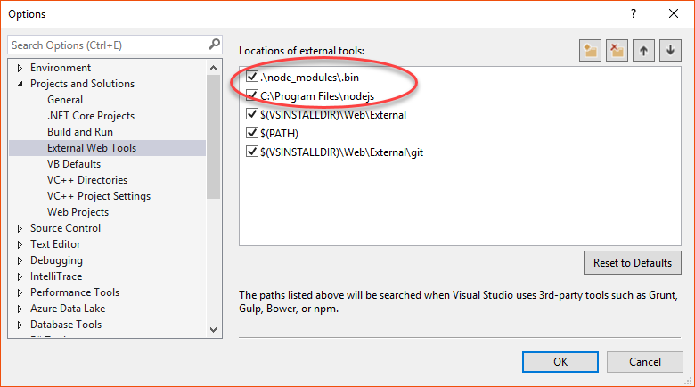
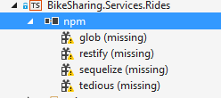

# BikeSharing360

During our Connect(); event this year we presented 15 demos in Scott Guthrie’s and Scott Hanselman’s keynotes. If you missed the keynotes, you can watch the recording in [Channel 9](https://channel9.msdn.com/Events/Connect/2016/Keynotes-Scott-Guthrie-and-Scott-Hanselman).

This year, we built the technology stack for a fictional company named BikeSharing360, which allows users to rent bikes from one location to another.

BikeSharing360 is a fictitious example of a smart bike sharing system with 10,000 bikes distributed in 650 stations located throughout New York City and Seattle. Their vision is to provide a modern and personalized experience to riders and to run their business with intelligence.

In this demo scenario, we built several apps for both the enterprise and the consumer (bike riders). You can find all other BikeSharing360 repos in the following locations:

* [Mobile Apps](https://github.com/Microsoft/BikeSharing360_MobileApps)
* [Backend Services](https://github.com/Microsoft/BikeSharing360_BackendServices)
* [Websites](https://github.com/Microsoft/BikeSharing360_Websites)
* [Single Container Apps](https://github.com/Microsoft/BikeSharing360_SingleContainer)
* [Multi Container Apps](https://github.com/Microsoft/BikeSharing360_MultiContainer)
* [Cognitive Services Kiosk App](https://github.com/Microsoft/BikeSharing360_CognitiveServicesKioskApp)
* [Azure Bot App](https://github.com/Microsoft/BikeSharing360_BotApps)

## Connect() 2016 Demos - Microservices

This repo contains the **backend microservices** used in various Connect() demos (mainly the Xamarin apps).

### Prerequisites

To create and deploy all microservices, you only need an **active Azure Subscription** and a Computer with the following software installed:

1. Visual Studio 2015 Update 3. Microservices code are in netcore and nodejs. Netcore microservices are based on project.json not on csproj, so don't use Visual Studio 2017. **If you want to use VS2017 RC use the VS2017-RC3 branch**.
2. Azure SDK .NET (2.9.6)
3. [NodeJS tools for Visual Studio](https://www.visualstudio.com/es/vs/node-js/)
4. NodeJs installed.

**Note:** The NodeJS version that comes with VS2015 is quite old, and still uses NPM 2. Using this version could lead you to the "Path too long" error. It is better to install a **newer version of node** (code was tested against NodeJs 6.4.0). After installing a new version of NodeJS you have to configure Visual Studio 2015 to use this newer version instead the previous one.

To configure VS2015 for using the new version of NodeJs, go to _Tools->Options->Projects and solutions->External web tools_ and add the paths _.\node_modules\.bin_ and _C:\program files\nodejs\_ to the top:

(This document assumes that you installed NodeJs in its default folder (C:\program files\nodejs). If you installed NodeJS in any other folder, update the path accordingly).

## Deploying to Azure

**Note:** The branch **VS2017** contains the same code ready to be loaded and compiled using VS2017 RC and the netcore tools in preview3 (no project.json).

Open the solution _BikeSharing.Services.Deploy.sln_. This solution contains the Microservices code and one ARM project to deploy them on any Azure Subscription.

If needed, install the missing NPM packages for the project _BikeSharing.Services.Rides_. Go to _Solution Explorer_ right click on the node _npm_ of the _BikeSharing.Services.Rides_ project, and select `Install Missing npm Packages`:

This will launch NPM and install all needed NPM packages for the project. Once this is completed just right click over the _BikeSharing.Services.Deploy_ project and select `Deploy -> New`. A dialog box will appear, asking you for your account and allowing you to select the subscription to use:

You can select one resource group or create one new. A set of default parameters has been provided, but you can override them with your own values clicking the "Edit parameters" button:

You can choose database names, SKUs to use and some other values (database login and password).

Once you've finished setting the parameters you can just click the "OK" button and the Microservices and databases will be deployed on the choosen resource group.

**Note: Microservices code is compiled** when you run the script, and **any compiler warning** is treated by an error by the publishing script. Current code has 0 errors and 0 warnings, but we aware if you edit the microservices code. If any warning is shown, Visual Studio will tell you that the deployment to Azure failed.

**Note:** Databases are created with no data. To add data to the database follow the steps in the next section.

## Adding data to databases

Once databases are created, you can run the SQL files to fill some sample data. You can use SQL Management studio or
your preferred tool to run the SQL files provided.

The files are in _/src/sql_, and there is one sql file for each database (rides-data.sql, feedback-data.sql, profiles-data.sql, events-data.sql)

**Note:** The _rides-data.sql_ is very big (around 0.5GB) because contains a lot of data. For that reason is zipped.

## Resources created in Azure

ARM project creates the following resources in Azure:

* 1 SQL server
* 4 SQL Azure databases (one per each microservice)
* 4 App Services (one per each microservice)
* 1 Storage account

Also it deploys the code to the 4 appservices and the schema to the 4 databases.

## Database projects

The solution file _BikeSharing.Services.sln_ contains **the code of all microservices AND database projects**. If you update the database schema, you can create a new DACPAC file using the dataase project.

**Note:** Database schema is deployed during the ARM project deployment by publishing DACPAC files. Those files were generated by these database projects (but just be aware that database projects are *not* compiled during the ARM deploy process. The ARM project has their own dacpac files in _src/BikeSharing.Services.Deploy/Data/dacpac_).

## Testing code in local environment

For testing the code for local environment you need to create the databases. ** Best way to create databases is using the database projects**. Just load them with Visual Studio 2015 and then publish them into your local database.

Then **update the config file of each microservice** (_appsettings.json_) and set the needed values (DB connection strings.)
The Rides service is different because is a nodejs microservice, so no _appsettings.json_ file exists. Configuration is using environment variables. Best way to set them with VS2015 is via "Project -> Properties" and set the environment variables:

Valid values are:

* **database** Name of the database (defaults to biksharing-services-rides)
* **databaseUserName** User name of db server
* **databasePassword** User password
* **databaseServer** Database server name (defaults to localhost)
* **serverInstance** Database instance name (only needed if not default instance is used)

SQL Server must be accessible via TCP protocol and has to have SQL authentication enabled.

## Events Seed

You can populate the events database with a new set of events, instead of using the sql file provided.

For doing this, once the database schema is created you need to open the solution __BikeSharing.Services.Events.Seed.sln__ and edit the configuration file (__appsettings.json__) located in __src/BikeSharing.Services.Events.Seed__. You need to provide **a valid Tickermaster API key** and a range of dates for the events.
Please refer to the file _src/BikeSharing.Services.Events.Seed/appsettings.json_ for more info.

The application __BikeSharing.Services.Events.Seed__ is a netcore 1.0 console application that will connect to TicketMaster API, find events on the range of dates provided (this range defaults from today to today plus 10 days) and populate the events database. Not all events are fed, only events that meet certain requeriments (like having a nice image and specific location).

In order to find how to get a TicketMaster API refer to [TicketMaster API documentation](http://developer.ticketmaster.com/).

** Note ** This application is provided __AS IS__ with no warranties. It is just provided to make easy for you to have a fresh & updated set of events. It is not intended to be production code (i. e. no error management)

** Note 2 ** This application has no VS2017 (preview3 tooling) version, so it is not included in the VS2017 branch.

## Azure Functions code

The folder _/azure-functions/ contains the solution _BikeSharing-Functions.sln_ with the code of the _AvatarPhotoProcess_ Azure Function (showed by Beth Massi). Function **is not** published to Azure by the ARM project.

If you publish the function, then **update the AzureWebJobsStorage setting of the FunctionApp** to use the storage deployed in the ARM project. This will ensure that photos uploaded by mobile app are processed by the Azure function.

Also you need to do two manual things in your Azure subscription:

1. Add a Cognitive API Services to your Azure Subscription (Face API)
2. Create an AppSetting in the FunctionApp named **Vision_API_Subscription_Key** with the value of the API KEY of the Face API.

**Note:** Azure functions projects are only supported by VS2015 Update 3 and require the [Visual Studio Tools for Azure Functions](https://blogs.msdn.microsoft.com/webdev/2016/12/01/visual-studio-tools-for-azure-functions/) installed.

## Final Notes

* Password is not really validated on login. If login is correct any not-null password is valid. This is to avoid errors on demos and showcases
* All APIs (except the rides one) have swagger enabled

## How to sign up for Microsoft Azure

You need an Azure account to work with this demo code. You can:

- Open an Azure account for free [Azure subscription](https://azure.com). You get credits that can be used to try out paid Azure services. Even after the credits are used up, you can keep the account and use free Azure services and features, such as the Web Apps feature in Azure App Service.
- [Activate Visual Studio subscriber benefits](https://www.visualstudio.com/products/visual-studio-dev-essentials-vs). Your Visual Studio subscription gives you credits every month that you can use for paid Azure services.
- Not a Visual Studio subscriber? Get a $25 monthly Azure credit by joining [Visual Studio Dev Essentials](https://www.visualstudio.com/products/visual-studio-dev-essentials-vs).

## Blog posts

Here's links to blog posts related to this project:

- Xamarin Blog: [Microsoft Connect(); 2016 Recap](https://blog.xamarin.com/microsoft-connect-2016-recap/)
- The Visual Studio Blog: [Announcing the new Visual Studio for Mac](https://blogs.msdn.microsoft.com/visualstudio/2016/11/16/visual-studio-for-mac/)
- The Visual Studio Blog: [Introducing Visual Studio Mobile Center (Preview)](https://blogs.msdn.microsoft.com/visualstudio/2016/11/16/visual-studio-mobile-center/)
- The Visual Studio Blog: [Visual Studio 2017 Release Candidate](https://blogs.msdn.microsoft.com/visualstudio/2016/11/16/visual-studio-2017-rc/)

## Clean and Rebuild
If you see build issues when pulling updates from the repo, try cleaning and rebuilding the solution.

## Copyright and license
* Code and documentation copyright 2016 Microsoft Corp. Code released under the [MIT license](https://opensource.org/licenses/MIT).

## Code of Conduct 
This project has adopted the [Microsoft Open Source Code of Conduct](https://opensource.microsoft.com/codeofconduct/). For more information see the [Code of Conduct FAQ](https://opensource.microsoft.com/codeofconduct/faq/) or contact [opencode@microsoft.com](mailto:opencode@microsoft.com) with any additional questions or comments.